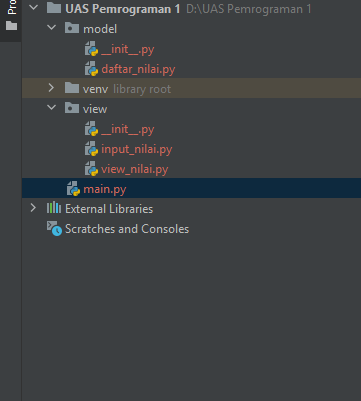
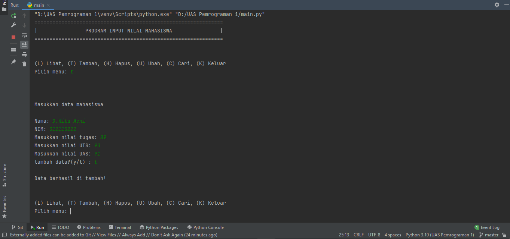

# UAS
## Profil
- Nama : D.Wita Aeni
- Nim : 312110222
- Kelas : TI.21.A.1
- Mata Kuliah : Bahasa Pemrograman

## SOAL UJIAN Edit Git Push


## Struktur Package & Module



- Didalam folder / package model terdapat 1 file dengan nama daftar nilai. Dan didalam file tersebut telah terdapat beberapa function yang dibuat untuk menjalankan program tersebut.<br>
- Berikut adalah isi dari file **daftar_nilai.py**

```python
from view.input_nilai import *

data = {}

Menambahkan data

def tambah_data():
global data
ulangi = 'y'
while ulangi =='y':
nama = input_nama()
nim = input_nim()
nilai_tugas = input_ntugas()
nilai_uts = input_nuts()
nilai_uas = input_nuas()
nilai_akhir = nakhir()
data[nama] = [nama, nim, nilai_tugas, nilai_uts, nilai_uas, nilai_akhir]
ulangi = (input('tambah data?(y/t) : '))

        if ulangi == 't':
            print('\nData berhasil di tambah!')
            return data

Mengubah data

def ubah_data():
nama = input("Masukan nama untuk mengubah data: ")
if nama in data.keys():
print("\nMau mengubah apa?")
sub_data = input("(Semua), (NIM), (Tugas), (UTS), (UAS) : ")
if sub_data.lower() == "semua":
print("==========================")
print("Ubah data {}.".format(nama))
print("==========================")
data[nama][1] = input("Ubah NIM:")
data[nama][2] = int(input("Ubah Nilai Tugas: "))
data[nama][3] = int(input("Ubah Nilai UTS: "))
data[nama][4] = int(input("Ubah Nilai UAS: "))
data[nama][5] = data[nama][2] *30/100 + data[nama][3]*35/100 + data[nama][4] \*35/100
print("\nBerhasil ubah data!")

        elif sub_data.lower() == "nim":
            data[nama][1] = input("\nNIM:")
            print('\nData berhasil di ubah!')
        elif sub_data.lower() == "tugas":
            data[nama][2] = int(input("\nNilai Tugas: "))
            data[nama][5] = data[nama][2] *30/100 + data[nama][3]*35/100 + data[nama][4] *35/100
            print('\nData berhasil di ubah!')
        elif sub_data.lower() == "uts":
            data[nama][3] = int(input("\nNilai UTS: "))
            data[nama][5] = data[nama][2] *30/100 + data[nama][3]*35/100 + data[nama][4] *35/100
            print('\nData berhasil di ubah!')
        elif sub_data.lower() == "uas":
            data[nama][4] = int(input("\nNilai UAS: "))
            data[nama][5] = data[nama][2] *30/100 + data[nama][3]*35/100 + data[nama][4] *35/100
            print('\nData berhasil di ubah!')
        else:
            print("\nMenu tidak ditemukan.")

    else:
        print("'{}' Tidak ditemukan.".format(nama))

Menghapus data

def hapus_data():
nama = input("Masukan nama untuk menghapus data : ")
if nama in data.keys():
del data[nama]
print("\nData '{}' berhasil dihapus.".format(nama))
else:
print("'{}' Tidak ditemukan.".format(nama))

Mencari data
def cari_data():
print("Mencari data: ")
print("=================================================")
nama = input("Masukan nama untuk mencari data: ")
print('\nResult')
print("==============================================================")
print("| Nama | NIM | Tugas | UTS | UAS | Akhir |")
print("==============================================================")
if nama in data.keys():
print("| {0:14} | {1:9} | {2:5} | {3:5} | {4:5} | {5:5}"
.format(nama, data[nama][1], data[nama][2], data[nama][3], data[nama][4], data[nama][5]))
print('--------------------------------------------------------------')
else:
print("'{}' Tidak ditemukan.".format(nama))
```

- Disisi lain saya membuat folder / package view yang berisi file input_nilai.py dan view_nilai.py<br>

- Berikut adalah isi dari file **input_nilai.py** :

```python
Menginput data
def input_nama():
    print("\nMasukkan data mahasiswa")
    global nama
    nama = input("\nNama: ")
    return nama


def input_nim():
    global nim
    nim = input("NIM: ")
    return nim


def input_ntugas():
    global nilai_tugas
    nilai_tugas = int(input("Masukkan nilai tugas: "))
    return nilai_tugas


def input_nuts():
    global nilai_uts
    nilai_uts = int(input("Masukkan nilai UTS: "))
    return nilai_uts


def input_nuas():
    global nilai_uas
    nilai_uas = int(input("Masukkan nilai UAS: "))
    return nilai_uas


# Nilai akhir
def nakhir():
    global nilai_akhir
    nilai_akhir = (nilai_tugas)*30/100 + (nilai_uts)*35/100 + (nilai_uas)*35/100
    return nilai_akhir
```

- Berikut adalah isi dari file **view_nilai.py** : <br>

```python
# Menampilkan data
from model.daftar_nilai import data

def lihat_data():
    print("Daftar Nilai:")
    print("===================================================================")
    print("| No |      Nama      |    NIM    | Tugas |  UTS  |  UAS  | Akhir |")
    print("===================================================================")
    if data.keys():
        no = 1
        for tabel in data.values():
            print("| {0:2} | {1:14} | {2:9} | {3:5} | {4:5} | {5:5} | {6:5} |".format
                (no, tabel[0], tabel[1], tabel[2], tabel[3], tabel[4], tabel[5]))
            print('-------------------------------------------------------------------')
            no += 1
    else:
        print("=========================TIDAK ADA DATA============================")
        print("===================================================================")
```

- Setelah membuat banyak folder / package dan function, saya membuat file index atau file utamanya. Yang saya beri nama _main.py_. Berikut isi dari file tersebut :<br>

```python
from model.daftar_nilai import *
from view.view_nilai import *

#Mulai
print("===============================================================")
print("|                PROGRAM INPUT NILAI MAHASISWA                |")
print("===============================================================")

while True:
    print("\n")
    menu = input("(L) Lihat, (T) Tambah, (H) Hapus, (U) Ubah, (C) Cari, (K) Keluar\nPilih menu: ")
    print("\n")

    # menu
    if menu.lower() == 't':
        tambah_data()

    elif menu.lower() == 'c':
        cari_data()

    elif menu.lower() == 'l':
        lihat_data()

    elif menu.lower() == 'u':
        ubah_data()

    elif menu.lower() == 'h':
        hapus_data()

    # Keluar
    elif menu.lower() == 'k':
        break

    else:
        print("Ada yang salah, Silahkan cek kembali.")
```

**Output:**

<p>Tambah data<p>



<p>Ubah data<p>


<p>Cari data<p>


<p>Hapus data<p>


<p>Keluar data<p>


### SELESAI
## TERIMA KASIH